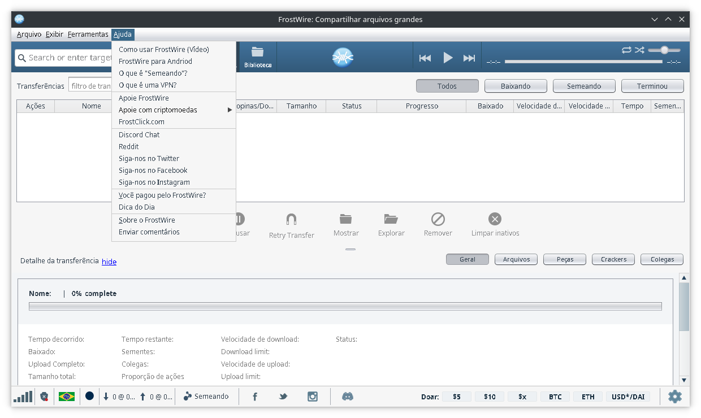
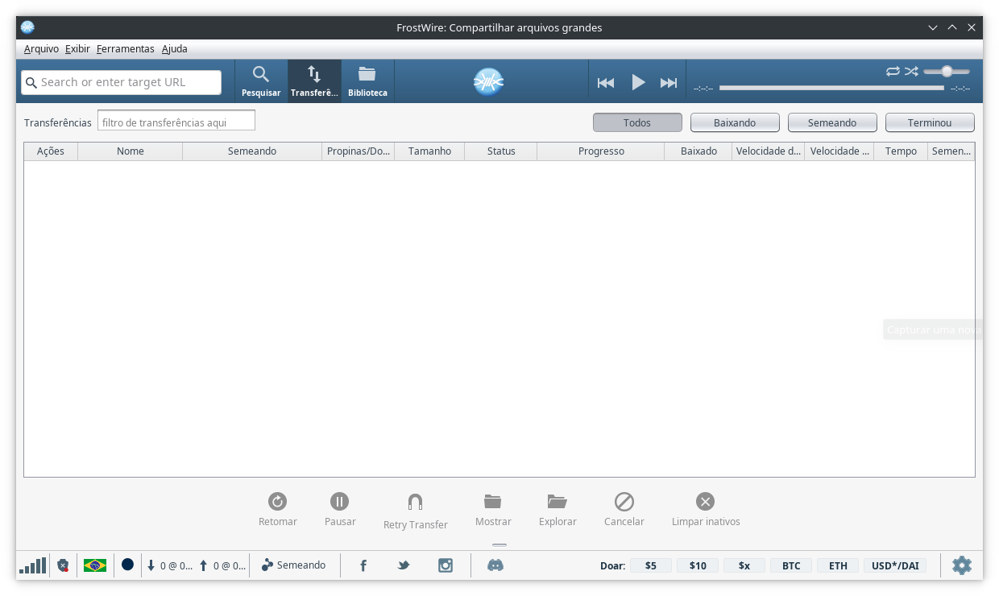

[Java]::
# Como Corrigir Fontes Feias em Aplicativos Java no Linux

Se você já precisou utilizar aplicativos Java, provavelmente já percebeu que,
em muitos casos, as fontes não aparecem como deveriam. Em muitos desses softwares
e até mesmo pequenos aplicativos Java independentes, o problema é o mesmo:
letras que parecem **"pixeladas"**, desajustadas ou simplesmente feias.
Isso não só prejudica a leitura, mas também pode causar desconforto visual,
principalmente durante longas horas de programação ou uso intenso do software.



A raiz do problema está no sistema de renderização de fontes do Java,
que historicamente não se integra muito bem aos sistemas Linux modernos.
Diferente do Windows, onde a JVM (Java Virtual Machine) consegue aproveitar melhor
a renderização do sistema, no Linux o mesmo frequentemente pode recorrer a métodos
internos que não respeitam suavização, anti-aliasing ou as configurações de DPI do
seu ambiente de desktop. O resultado? Fontes borradas, espaçamento irregular e uma
aparência geral que passa sensação de “datado” ou pouco polido.

Além disso, esse problema pode variar dependendo da distribuição, do ambiente gráfico
(GNOME, KDE, XFCE, etc.) e até do tipo de instalação da JVM. Para complicar,
alguns aplicativos Java ignoram completamente as configurações do sistema, 
aplicando suas próprias renderizações internas, o que faz com que ajustes globais
de fontes e suavização não tenham efeito.

Neste guia, vamos explorar como melhorar drasticamente a aparência das fontes em
aplicativos Java no Linux. A solução consiste em habilitar manualmente o
antialiasing e outras propriedades de renderização de texto, tanto de forma
**global** (para todas as aplicações Java) quanto de forma **individual**
(apenas para um programa específico).

Essas configurações você vai usar quando:
- O sistema não tem um daemon xsettings e você não quer instalar um;
- Você não tem acesso ao código-fonte do programa em Java. 

## 1. Solução global (para todas as aplicações Java)

Você pode adicionar as configurações no seu arquivo de inicialização de sessão,
como `~/.profile`, `~/.bashrc`, `~/.zshrc`, ou até no `/etc/profile`
para afetar todos os usuários do sistema.

Você vai usar uma variável de ambiente para configurar o anti-aliasing:
```bash
_JAVA_OPTIONS="-Dawt.useSystemAAFontSettings=<OPTIONS>"
```

Onde \<OPTIONS\> é um dos valores:

| **Configuração**                   | **Descrição**                                          |
| ---------------------------------- | ------------------------------------------------------ |
| `off`, `false`, `default`          | Sem antialiasing                                       |
| `on`                               | Antialiasing completo                                  |
| `gasp`                             | Usa as instruções de hinting embutidas na fonte        |
| `lcd`, `lcd_hrgb`                  | Antialiasing otimizado para muitos monitores LCD       |
| `lcd_hbgr`, `lcd_vrgb`, `lcd_vbgr` | Alternativas para monitores LCD com diferentes padrões |

As configurações **gasp** e **lcd** são os mais recomendados, mas **on** é o mais
abrangente.

Outra opção inclui ativar explicitamente o antialiasing para componentes Swing:
```bash
_JAVA_OPTIONS="-Dswing.aatext=true"
```

Opcionalmente, é possível também usar a aparência do GTK adicionando o seguinte:
```bash
_JAVA_OPTIONS='-Dswing.defaultlaf=com.sun.java.swing.plaf.gtk.GTKLookAndFeel'
```

E por fim, para configurar todas as opções de antialiasing, é só adicionar a
seguinte linha em algum arquivo de configurações de variáveis de sua preferência
(como os citados acima, `~/.profile`, `~/.bashrc`, `~/.zshrc`, `/etc/profile`, etc):

```bash
export _JAVA_OPTIONS='-Dawt.useSystemAAFontSettings=on -Dswing.aatext=true'
```

Ao reiniciar a sessão ou até mesmo o sistema, o problema estará resolvido.



## 2. Solução individual (apenas para um programa)

Se você não quiser aplicar a configuração para todos os programas,
pode rodar uma aplicação Java com os parâmetros diretamente na linha de comando ou
adicionar as opções no script que inicia o programa em java:

```bash
java -Dawt.useSystemAAFontSettings=on -Dswing.aatext=true -jar programa.jar
```

Nesse caso, somente o `programa.jar` usará as configurações de renderização de fontes.

## 3. Fontes TrueType

As fontes TrueType parecem ser o melhor formato suportado pelo Java. Alguns aplicativos
Java podem precisar usar alguma fonte TrueType específica e precisam do caminho do
diretório para a fonte desejada. As fontes TrueType por padrão, são instaladas
no diretório /usr/share/fonts/TTF. Portanto, use:

```bash
JAVA_FONTS="/usr/compartilhar/fontes/TTF"
```

Essa opção também pode ser configurado via profile.

## Conclusão

Com esses ajustes simples, é possível corrigir o problema de fontes feias em
aplicativos Java no Linux. A solução global é prática se você utiliza muitos
programas Java, enquanto a solução individual é ideal para testar ou aplicar
em apenas um software específico.

### Fontes

* https://wiki.archlinux.org/title/Java_Runtime_Environment_fonts
* https://batsov.com/articles/2010/02/26/enable-aa-in-swing/
* https://askubuntu.com/questions/636666/ugly-non-anti-aliased-fonts-in-java-swing-applications
