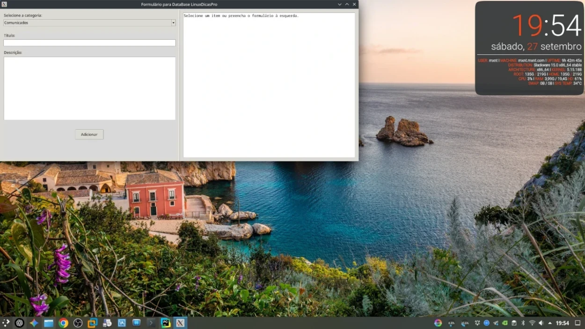
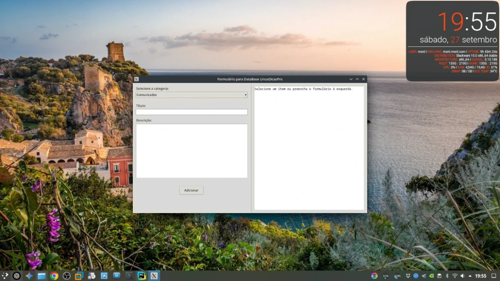

[Python]::
# Como Criar uma Janela Tkinter Centralizada em Python

Quando desenvolvemos aplicações gráficas em **Python com Tkinter**, é comum
precisarmos abrir a janela já **centralizada na tela**. Em muitos tutoriais,
isso é feito manualmente, definindo largura e altura fixas. Mas podemos encapsular
essa lógica em uma **classe**, tornando o código mais organizado e reutilizável.

## Estrutura com Classe

As janelas em Tkinter não centralizam por padrão.



A ideia é criar uma classe que herde de `tk.Tk`, e dentro dela implementar um
método responsável por calcular a posição da janela com base no tamanho da tela
e no próprio conteúdo da aplicação.

### Exemplo de Código

```python
import tkinter as tk

class App(tk.Tk):
    def __init__(self):
        super().__init__()

        self.title("Janela Centralizada com Classe")

        # Adiciona um exemplo de widget
        tk.Label(self, text="Minha janela centralizada!").pack(padx=20, pady=20)

        # Chama centralização automática
        self.centralizar()

    def centralizar(self):
        """Centraliza a janela automaticamente sem precisar definir tamanho fixo."""
        self.update_idletasks()  # Atualiza medidas da janela

        largura = self.winfo_width()
        altura = self.winfo_height()
        largura_tela = self.winfo_screenwidth()
        altura_tela = self.winfo_screenheight()

        x = (largura_tela // 2) - (largura // 2)
        y = (altura_tela // 2) - (altura // 2)

        self.geometry(f"{largura}x{altura}+{x}+{y}")

if __name__ == "__main__":
    app = App()
    app.mainloop()
```



## Como Funciona

1. A classe `App` herda de `tk.Tk`, tornando-se a janela principal.
2. Dentro do `__init__`, criamos os widgets (no exemplo, apenas um `Label`).
3. O método `centralizar()`:
   - Atualiza as dimensões reais da janela com `update_idletasks()`.
   - Obtém a largura e altura da tela com `winfo_screenwidth()` e `winfo_screenheight()`.
   - Calcula as coordenadas `x` e `y` para centralizar.
   - Aplica a geometria final com `.geometry()`.

## Vantagens

- Código organizado em classe.
- Janela centralizada **automaticamente** com base no conteúdo.
- Fácil de reutilizar em outros projetos Tkinter.

## Conclusão

Assim, sempre que precisar de uma janela centralizada no Tkinter,
basta criar a classe herdando de `tk.Tk` e chamar o método `centralizar()`.
Isso deixa o código limpo, reutilizável e profissional.
