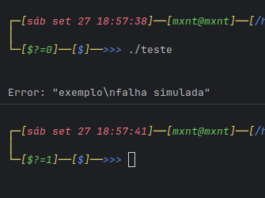

[Rust]::
# Tratando Erros com Quebra de Linha de Comandos em Rust

Em programas de linha de comando (CLI) em Rust, a forma como tratamos mensagens
de erro influencia diretamente a legibilidade e a usabilidade do programa.
Um problema comum é que quebras de linha (`\n`) nas mensagens de erro são
escapadas e exibidas literalmente, tornando a saída confusa.

Neste artigo, será detalhado um tratamento alternativo de erros com quebras de
linha em Rust, mostrando diferentes abordagens, suas vantagens e boas práticas.

## 1. O Problema com `run()?`

Considere a função `run` abaixo, que retorna um erro com múltiplas linhas:

```rust
fn run() -> Result<(), Box<dyn std::error::Error>> {
    Err("exemplo\nfalha simulada".into())
}
```

Se chamarmos `run()?` diretamente em `main`:

```rust
fn main() -> Result<(), Box<dyn std::error::Error>> {
    run()?;
    Ok(())
}
```

- O operador `?` propaga o erro para `main()`.  
- A mensagem não será exibida corretamente no terminal, pois o `\n` aparece literalmente
na saída do terminal e não quebra a linha.



Isso ocorre porque o erro não é explicitamente tratado para exibição e nem
impresso no **stderr**.

## 2. Solução Idiomática: `match` + `eprintln!`

Uma forma alternativa de lidar com erros multiline é capturando o
resultado da função e imprimindo a mensagem com `eprintln!`:

```rust
fn main() {
    let exit_code: i32 = match run() {
        Ok(()) => 0,
        Err(e) => {
            eprintln!("Erro: {}", e);
            1
        }
    };

    std::process::exit(exit_code);
}
```

- `eprintln!` envia a mensagem para o **stderr**, o canal correto para
exibir mensagens de erro.  
- `{}` interpreta a mensagem com `\n` como quebra de linha, exibindo corretamente.


- `std::process::exit(exit_code)` garante que o programa saia com o código de erro correto (`0` para sucesso, `1` para erro), importante para scripts e pipelines.

## 3. Por que evitar `run()?` direto em CLIs

Embora `run()?` seja idiomático para funções internas, em CLIs ele apresenta limitações:

- **Controle de saída:** você não consegue customizar com precisão 
como a mensagem de erro aparece.  
- **Legibilidade:** mensagens multiline serão certamente escapadas.  

## 4. Alternativa com `unwrap_or_else`

Outra abordagem idiomática é usar `unwrap_or_else` para tratar erros no
momento da chamada:

```rust
fn main() {
    run().unwrap_or_else(|e| {
        eprintln!("Erro: {}", e);
        std::process::exit(1);
    });

    std::process::exit(0);
}
```

- O closure é chamado somente se houver erro.  
- `eprintln!` garante interpretação correta das quebras de linha.  
- Código de saída é definido explicitamente.

### 5. Vantagens do padrão `run() -> Result` + `match`/`unwrap_or_else`

- **Separação de responsabilidades:** `run()` cuida da lógica, `main()` cuida da 
saída e do código de erro.  
- **Mensagens legíveis:** quebras de linha são preservadas.  
- **Compatibilidade com scripts:** códigos de saída consistentes facilitam
integração com pipelines.  
- **Flexibilidade:** permite customizar prefixos, logs e comportamentos sem 
alterar `run()`.

## 6. Boas Práticas

1. Sempre use `Box<dyn Error>` em funções que podem retornar diferentes tipos de erro.  
2. Prefira `eprintln!` para mensagens de erro, nunca `println!`.  
3. Use `match` ou `unwrap_or_else` em `main()` para capturar erros e definir
código de saída.  
4. Evite imprimir diretamente `Err(...)` com `{:?}`, especialmente se houver `\n`.  
5. Mantenha a lógica do programa separada do tratamento de saída.

## 7. Conclusão

O tratamento adequado de erros em programas de linha de comando em Rust não é
apenas uma questão estética, mas de usabilidade e profissionalismo.
Ao invés de confiar no run()? direto em main(), é recomendável adotar um padrão
claro de captura e exibição dos erros, usando match ou unwrap_or_else em conjunto
com eprintln!.

Isso garante:
- Mensagens claras e legíveis, sem \n escapados.
- Códigos de saída corretos, fundamentais para scripts e pipelines.
- Separação de responsabilidades, mantendo a lógica em run() e a comunicação com o
usuário em main().

Seguindo essas práticas, você terá CLIs mais consistentes, fáceis de integrar
em automações e que passam maior confiança para o usuário final.
