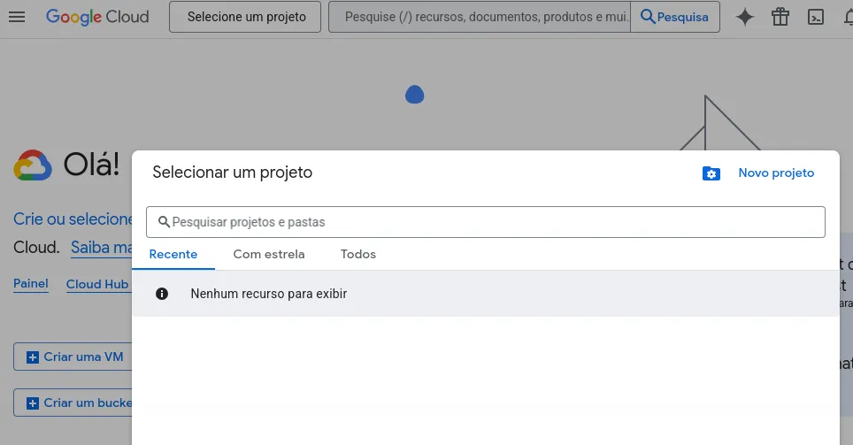
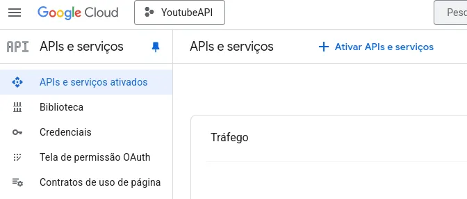
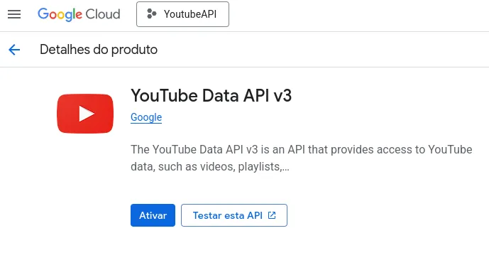
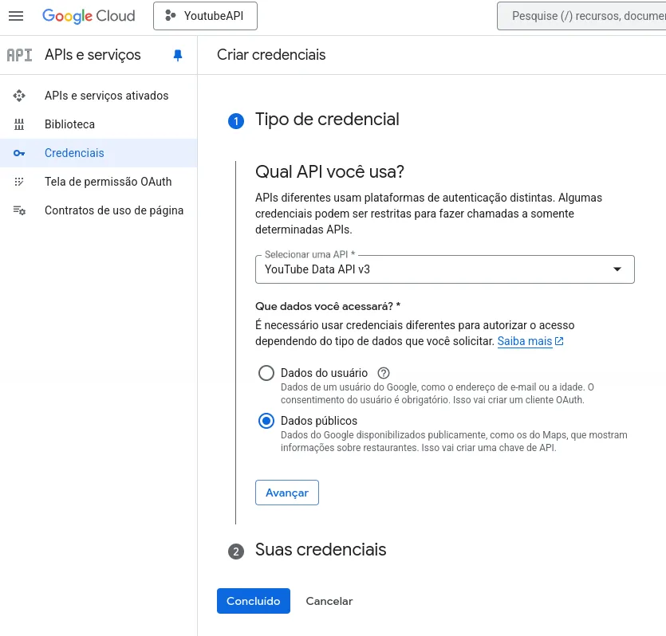
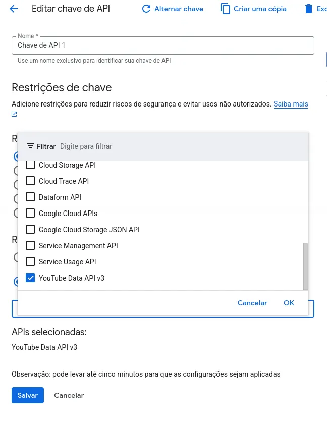

[API]::
# Como Obter a Chave API do YouTube

A API do YouTube permite que desenvolvedores acessem dados de vídeos,
playlists e canais de forma programática. Com ela, é possível criar aplicativos,
dashboards e automações que interagem diretamente com o YouTube. Para começar a
usar essa API, é necessário obter uma chave API vinculada à sua conta Google.

## Passo a Passo para Obter a Chave API

### 1. Crie uma Conta no Google

Se você ainda não possui uma conta Google, crie uma em
[accounts.google.com](https://accounts.google.com/). 
A chave API estará vinculada à sua conta.

### 2. Acesse o Google Cloud Console

- Vá para o [Google Cloud Console](https://console.cloud.google.com/).
- Faça login com sua conta Google.

### 3. Crie um Projeto

- No canto superior esquerdo, clique em **Selecione um projeto** e **Novo projeto**.



- Dê um nome ao projeto (por exemplo, `YouTubeAPI`).
- Clique em **Criar**.

### 4. Habilite a API do YouTube

- No menu lateral, clique em **APIs e serviços** e **Biblioteca** ou
**Ativar APIs e Serviços**.



- Procure por **YouTube Data API v3**.
- Clique nela e depois em **Ativar**.



### 5. Crie as Credenciais

- Após habilitar a API, clique em **Criar credenciais**.
- Em **Que tipo de credenciais você precisa?**, selecione **Dados publicos**,
que é opção que gera a chave de API.



- Clique em avançar e uma chave será gerada. Copie-a para usar em seu projeto.
Você também pode consultar facilmete a chave depois em **Exibir chave**.

**Importante:** Não compartilhe sua chave publicamente. Ela pode ser usada por
terceiros e consumir sua cota de API. Geralmente, as opções gratuítas tem
limitações de uso.

### 6. Configurações Opcionais

- No painel de credenciais, clique na sua chave gerada para restringir a chave,
geralmente tem um ícone de alerta e nessa tela você edita as opções da chave de API.
- Você tem as **Restrições do aplicativo** e as **Restrições da API** que geralmente
já é o suficiente. Se quiser, pode adicionar mais opções de API, mas no nosso caso
será só para o YouTube mesmo.



### 7. Uso Básico da Chave

Exemplo de requisição HTTP para obter informações de um vídeo:
```bash
https://www.googleapis.com/youtube/v3/videos?part=snippet&id=VIDEO_ID&key=SUA_CHAVE_API
```
Substitua `VIDEO_ID` pelo ID do vídeo e `SUA_CHAVE_API` pela sua chave.

## Conclusão

Obter a chave API do YouTube é um processo simples, mas essencial para qualquer
projeto que precise interagir com os dados da plataforma. Com ela, é possível
desenvolver soluções personalizadas, monitorar conteúdo e automatizar tarefas de
maneira eficiente, garantindo o uso seguro e controlado da API.

