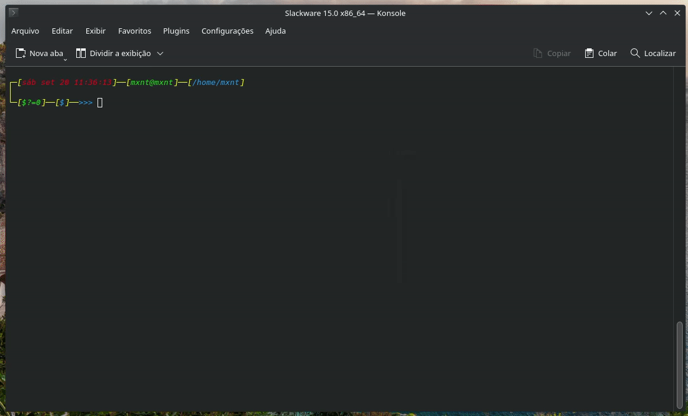
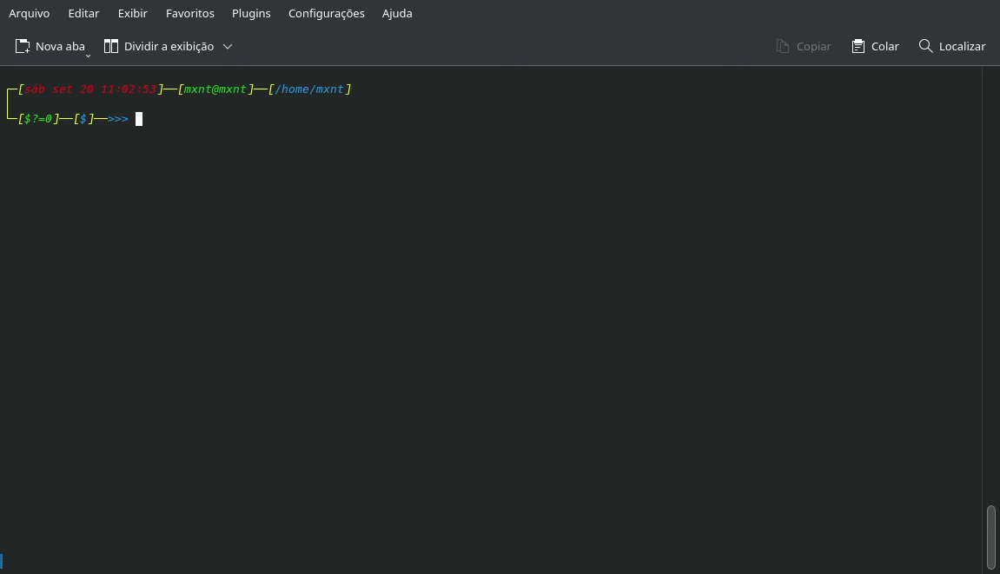
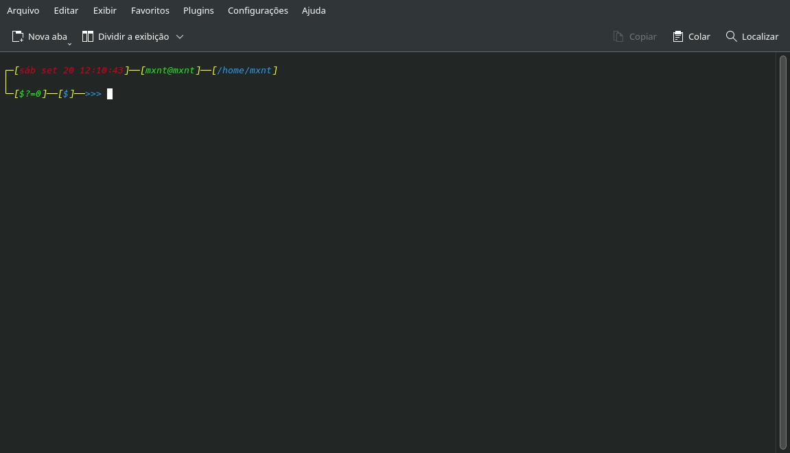
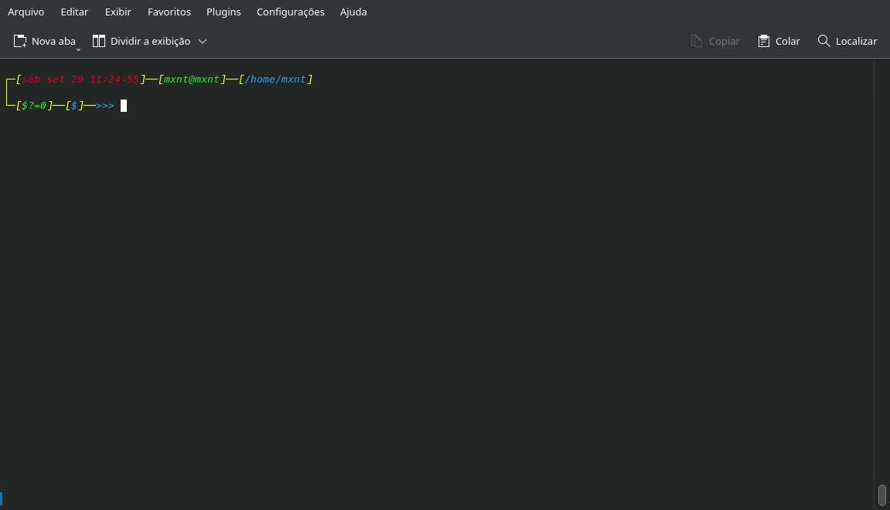

# ALPack - Alpine Linux SandBox Packager

## Gerencie Ambientes Alpine e Compile Binários Estáticos com Simplicidade

**ALPack** é uma ferramenta shell simples projetada para criar e gerenciar
*rootfs* do **Alpine Linux** de forma prática e reproduzível. Ele funciona com
**proot** ou **bubblewrap (bwrap)** e foi pensado para ser distribuído como
**binário estático** — ou seja, sem dependências dinâmicas no host — facilitando
o uso em cenários de CI, máquinas de desenvolvedor e ambientes isolados.

Ele foi criado especialmente para compilação de binário estático. Portanto, por
padrão ele vai gerar um rootfs completo pronto para trabalhar com builds e
desenvolvimento de pacotes. Porém, há parâmetros que podem ser usados para
configuração de um ambiente mínimo.

ALPack é uma ferramenta pensada para simplicidade e eficiência: um binário que
**não exige dependências** para ser distribuído e que
**oferece um ambiente Alpine isolado** ideal para compilar binários estáticos,
testar APKBUILDs e criar pacotes reprodutíveis. A combinação de rootfs leve,
suporte a `proot`/`bwrap` e utilitários integrados torna o ALPack uma opção
prática para desenvolvedores e pipelines de CI.



## Objetivo

- Ser simples, prático e autossuficiente;
- Pode ser usado como ambiente Alpine em sandbox;
- Feito para testar e trabalhar com **APKBUILDs** mesmo fora do Alpine Linux;
- Especialmente criado para **compilação de binários estáticos**.

## Principais Funcionalidades

- Criar e manter um ambiente Alpine Linux pronto para desenvolvimento;
- Suporte a criação de ambientes mínimos.
- Rodar comandos dentro do rootfs via `proot` ou `bwrap`;
- Instalar/gerenciar pacotes com `apk` dentro do rootfs;
- Ferramentas para pesquisar e baixar `aports` e compilar **APKBUILDs** via `builder`;
- Instalar, remover e pesquisar pacotes no ambiente isolado;
- Compatível com builds e workflows de **binários estáticos**.

## 🚀 Uso

```bash
ALPack <parâmetro> [opções] [--] [ARGS...]
```

## 📌 Parâmetros Disponíveis

- **setup** ➔ Inicializa ou configura o ambiente rootfs  
- **run** ➔ Executa comandos dentro do rootfs  
- **config** ➔ Exibe ou modifica a configuração global  
- **aports** ➔ Gerencia repositórios locais do *aports*  
- **builder** ➔ Utilitário para construir pacotes e imagens  
- **apk** ➔ Executa o gerenciador de pacotes `apk`  
- **add | install <ARGS>** ➔ Instala pacotes no rootfs  
- **del | remove <ARGS>** ➔ Remove pacotes do rootfs  
- **-s, search <ARGS>** ➔ Busca pacotes disponíveis  
- **-u, update** ➔ Atualiza índices e pacotes instalados  
- **fix** ➔ Tenta corrigir pacotes quebrados  

## ⚙️ Opções por parâmetro

### 📌 Setup
- `--no-cache` ➔ Desabilita cache  
- `-r, --reinstall` ➔ Reinstala pacotes  
- `--edge` ➔ Usa o repositório *edge*  
- `--minimal` ➔ Instala apenas pacotes mínimos  
- `--mirror=<URL>` ➔ Define mirror Alpine  
- `--cache=<DIR>` ➔ Define diretório de cache  
- `-R, --rootfs=<DIR>` ➔ Define diretório rootfs  

### 📌 Run
- `-0, --root` ➔ Executa com privilégios de root  
- `-i, --ignore-extra-binds` ➔ Ignora binds adicionais  
- `-b, --bind-args <ARGS>` ➔ Montagens extras  
- `-c, --command <CMD>` ➔ Comando(s) a executar  
- `-R, --rootfs=<DIR>` ➔ Define diretório rootfs  

### 📌 Config
- `--use-proot` ➔ Usa **proot** (padrão)  
- `--use-bwrap` ➔ Usa **bubblewrap**  
- `--use-latest-stable` ➔ Usa release *latest-stable* (padrão)  
- `--use-edge` ➔ Usa release *edge*  
- `--cache-dir=<DIR>` ➔ Define diretório de cache  
- `--output-dir=<DIR>` ➔ Define diretório de saída  
- `--rootfs-dir=<DIR>` ➔ Define diretório rootfs  
- `--default-mirror=<URL>` ➔ Define mirror padrão  

### 📌 Aports
- `-u, --update` ➔ Atualiza repositório local  
- `-s, --search=<PKG>` ➔ Busca pacote no aports  
- `-g, --get=<PKG>` ➔ Baixa APKBUILD  
- `-R, --rootfs=<DIR>` ➔ Define diretório rootfs  

### 📌 Builder
- `-a, --apkbuild=<APKBUILD>` ➔ Usa APKBUILD específico  
- `-R, --rootfs=<DIR>` ➔ Define diretório rootfs  

## 🌍 Variáveis de Ambiente

- `ALPACK_ARCH` ➔ Arquitetura alvo (`x86_64`, `aarch64`, etc.)  
- `ALPACK_ROOTFS` ➔ Caminho para o rootfs usado pelo ALPack  
- `ALPACK_CACHE` ➔ Caminho para o cache usado pelo ALPack  

## Por que usar ALPack para Compilar Binários Estáticos?

Compilar binários estáticos tem grande vantagem quando você precisa distribuir
um executável que não dependa da libc do host ou de bibliotecas dinâmicas.
ALPack facilita esse processo porque:

- Fornece um **rootfs Alpine pronto e previsível**, ou um ambiente mínimo onde você
  pode controlar as versões das ferramentas de build.
- Isola o build do sistema host (sem sujar o sistema ou depender de toolchains locais).
- É possível distribuir ALPack como binário estático, simplificando a portabilidade
  da própria ferramenta para qualquer ambiente sem instalar várias dependências.
- Suporta workflows com `APKBUILD`/`abuild` ou builds manuais, permitindo empacotar
  o resultado como APK ou tarball.

## Preview







## Exemplos Básicos

Abaixo um fluxo prático, pensado para ser direto e repetível.

### 1) Como Preparar o Ambiente Rootfs

```bash
$ ALPack setup --edge 
```

### 2) Como Executar um Comando dentro do Rootfs

```bash
$ ALPack run -- cat /etc/os-release
$ ALPack run -c "cat /etc/os-release"
```

### 3) Exemplo de como Montar/Fornecer o Código-Fonte ao Rootfs

Você pode bindar a pasta do seu projeto no host dentro do rootfs com `--bind-args`:

```bash
$ ALPack run --bind-args "--bind /home/usuario/projeto:/src" -c "cd /src && ./build.sh"
```

ou copiar o código para o rootfs quando necessário.

### 4) Como Compilar com Flags de Link Estático

Para C/C++ (exemplo usando `gcc`):

```bash
# dentro do rootfs
export CFLAGS="-O2 -pipe -static -s"
export LDFLAGS="-static"
make
# ou
gcc $CFLAGS -o meuapp src/main.c $LDFLAGS
```

Após a compilação, verifique se o binário é realmente estático:

```bash
$ ldd meuapp || true  # se responder "not a dynamic executable" é estático
# ou
$ readelf -d meuapp | grep NEEDED || true
```

Remova símbolos desnecessários: 
```bash
$ strip --strip-all meuapp
```

## Notas sobre **proot** vs **bubblewrap** (bwrap)

- **proot**: implementa chroot/sandbox através de emulação de chamadas de sistema
no espaço do usuário. Funciona em praticamente qualquer distribuição e não exige
suporte do kernel (sem user namespaces).
- **bwrap (bubblewrap)**: usa user namespaces e recursos do kernel para isolamento real;
pode ser mais eficiente e mais seguro, porém requer suporte do kernel e permissões
adequadas.

ALPack permite escolher entre os dois via `config` (`--use-proot` ou `--use-bwrap`).
